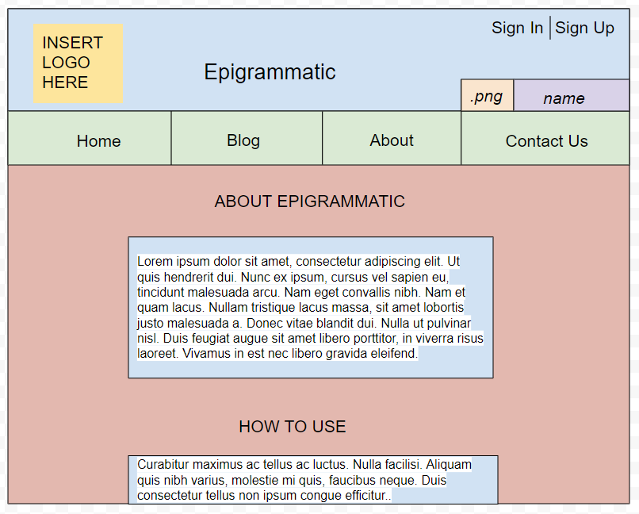
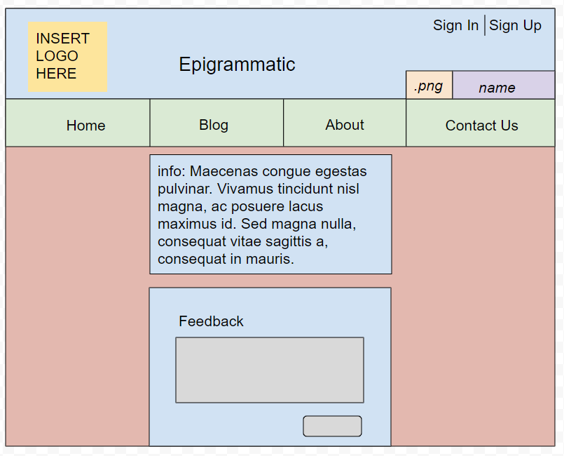
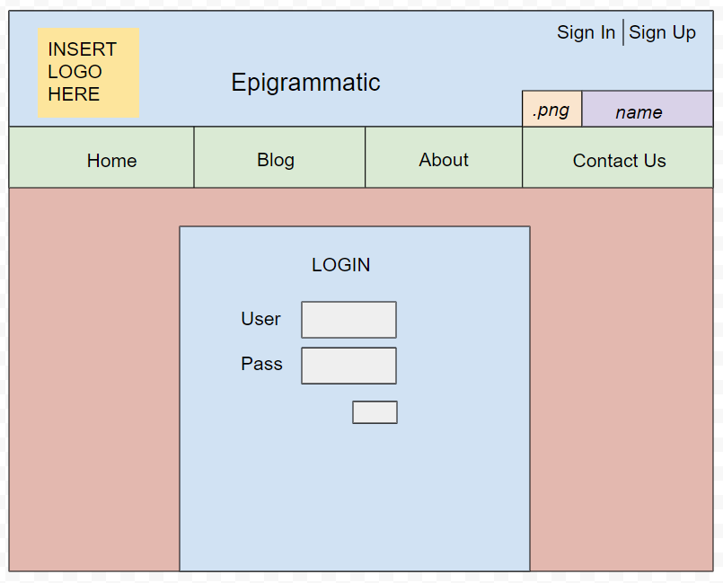
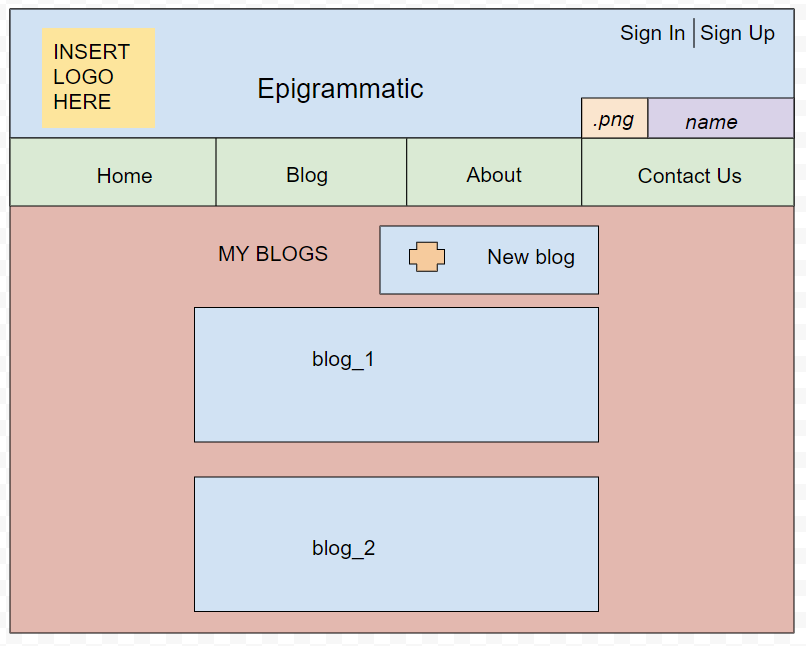
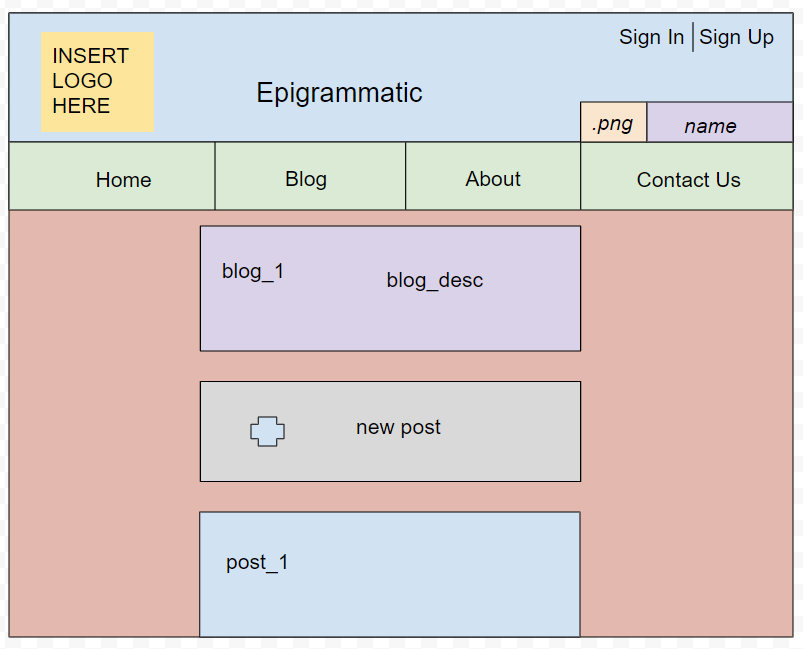
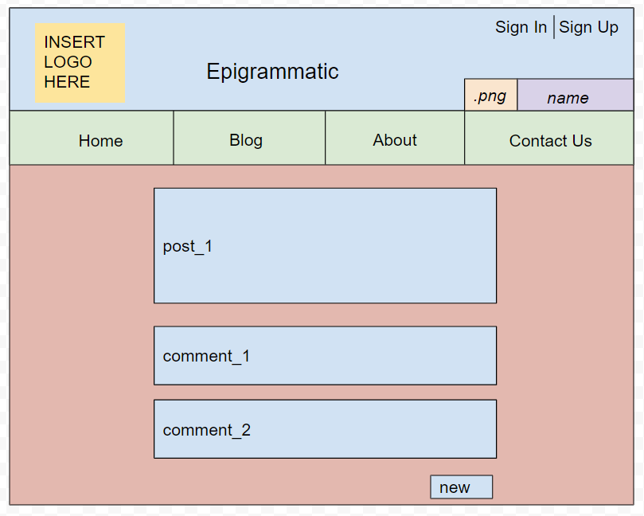
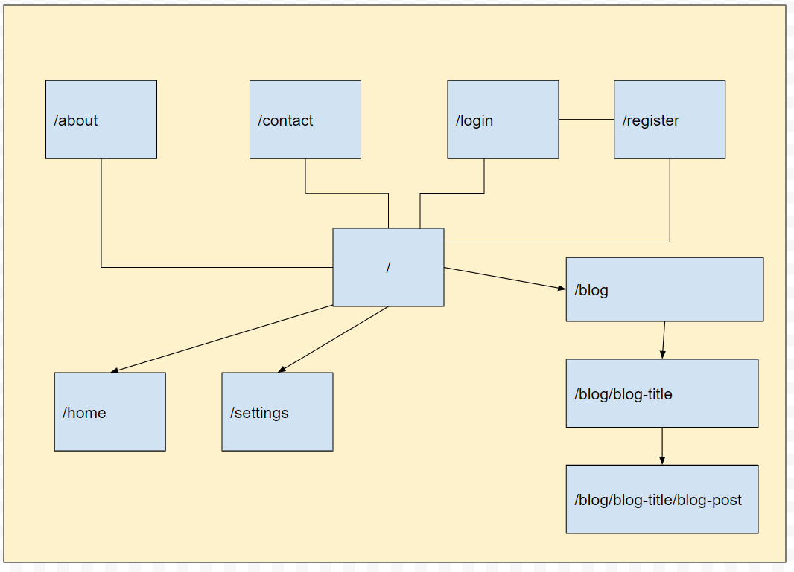

# Epigrammatic

## Overview

Starting a personal blog is an onerous endeavor. Whether it be a lack of a reliable platform or an understanding of how to begin one, an individual would normally have to spend copious number of hours learning how to simply post their ideas online. Then, sharing the posts becomes a burden, as not everyone will have an immediate audience. Sooo... that's where Epigrammatic comes in!

Epigrammatic is a tool for novice and experienced writers to write and share their ideas with other users on the site. Any user can read publicly posted blogs on the site. However, a user would have to be logged in to write their own blogs and comment on others. The site is a versatile medium for anyone interested in posting.


## Data Model

The application will store Users, Feedback, Posts, and Comments

* users can have multiple posts
* users can have multiple comments
* users can have multiple feedback
* each blog can have multiple posts
* each post can have multiple comments

The application will also store Feedback (not directly related to any posts)

An Example User:

```javascript
{
  username: "walterwriter",
  hash: // a password hash,
  first: "walter", // first name (optional),
  last: "doe", // last name (optional),
  epithet: "a witty writer", // user description (optional),
  about: "hello world", // short bio (optional),
  creationDate: // timestamp,
}
```

An Example Post:

```javascript
    user: "john",
    header: "hello",
    body: "world",
	slug: "blog/john/hello",
	userslug: //slug,
	headerslug: //slug,
    createdAt: //timstamp,
```

An Example Comment:

```javascript
{
    user: "john",
	url: "linserv1.cims.nyu.edu:29061/blog/c/a",
	slug: "blog/c/a",
	comment: "hello",
    createdAt: //timestamp,
}
```

An Example Feedback:

```javascript
{
	name: "john",
	feedback: "hello",
}
```

## [Link to Commented First Draft Schema](db.js)

## Wireframes

/home - homepage. recent blogs and comments are visible


/about - description of site



/contact-us - contact info and feedback



/login



/register


/blog - user's list of blogs



/blog/{blogtitle} - user's posts for a specific blog



/blog/{blog-title}/{post-title} - page for the specific blogpost



## Site map



## User Stories or Use Cases

* as non-registered user, I can register a new account with the site
* as non-registered user, I can view the homepage to see the latest posts and comments
* as non-registered user, I can also view: /search, /about, /contact-us
* as non-registered user, I can submit feedback about the site in /contact-us
* as a user, I can log in to the site
* as a user, I can view the comments related to a post in a specific blog
* as a user, I can comment on my own post
* as a user, I can comment on other people's posts
* as a user, I can view all the pages that a non-registered user can view

## [Link to Initial Main Project File](app.js)

## Annotations / References Used

* [passport.js authentication docs](http://passportjs.org/docs)
* [slug doc](https://www.npmjs.com/package/slug)
